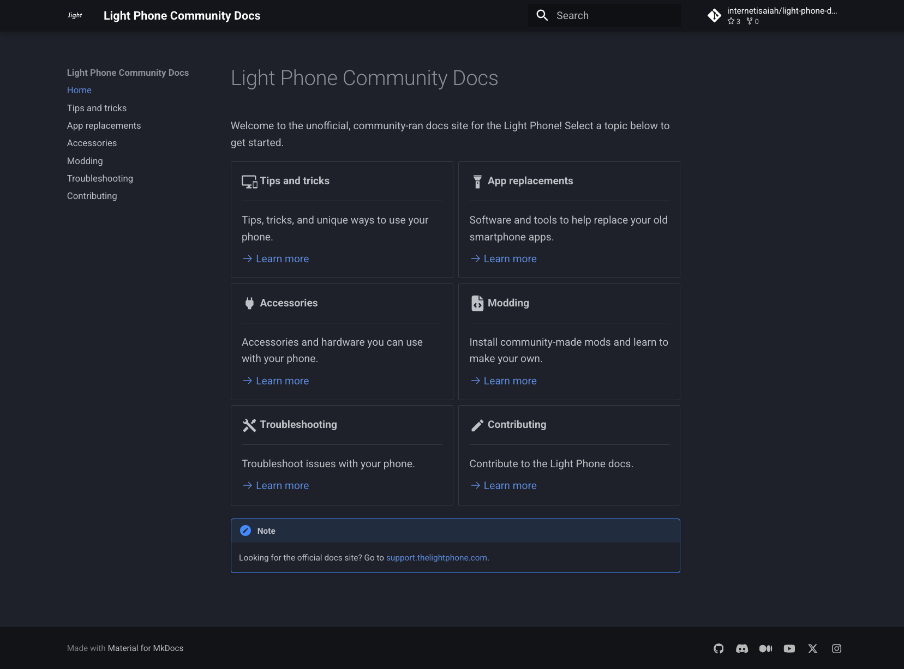

# Light Phone Docs

These are the source files used to build the [(un)official Light Phone docs](https://internetisaiah.github.io/light-phone-docs/). If you'd like to help improve the docs, you can:

- [Report an issue](https://github.com/internetisaiah/light-phone-docs/issues/new?assignees=&labels=bug&projects=&template=report_an_issue.md&title=)
- [Request a feature](https://github.com/internetisaiah/light-phone-docs/issues/new?assignees=&labels=enhancement&projects=&template=request_a_feature.md&title=)
- [Contribute content](https://internetisaiah.github.io/light-phone-docs/contributing/)
- [Join the unofficial Discord server](https://discord.com/invite/8ggjn69pPR)
 
> **Note:** The Discord server is not run by any of our moderators, but it's still the best place to connect with members of our community and other Light Phone users.

## Site components

The following components are used to build and deploy the docs site.

| Component | Description | Solution |
|----------|-------------|----------|
| Static-Site Generator (SSG) | A framework for building and styling the site. | [Material for MkDocs](https://squidfunk.github.io/mkdocs-material/getting-started/) |
| Server | Hosts the docs site using the files the GitHub repository. | [GitHub Pages](https://pages.github.com/) |
| Information Architecture | This is how content is structured across the site and on each page. | [Diátaxis](https://diataxis.fr/) |
| Style Guide | This is how content on each page is written. | [Microsoft Style Guide](https://learn.microsoft.com/en-us/style-guide/welcome/) |

## Building the docs locally

Light Phone Docs uses [Material for MkDocs](https://squidfunk.github.io/mkdocs-material/) to build the site, which requires `pip`, a Python package manager typically included with [Python3](https://www.python.org/downloads/). Run the following command to check if its installed. If its not, install it now.

```bash
pip3 --version
```

To install `mkdocs-material`, run:

```bash
pip3 install mkdocs-material
```

To build the docs locally, run:

```bash
mkdocs serve
```

Your terminal output will be similar to the following:

```bash
➜  light-phone-docs git:(develop) mkdocs serve                        
INFO    -  Building documentation...
INFO    -  Cleaning site directory
INFO    -  Documentation built in 0.18 seconds
INFO    -  [21:59:33] Watching paths for changes: 'docs', 'mkdocs.yml'
INFO    -  [21:59:33] Serving on http://127.0.0.1:8000/
INFO    -  [21:59:34] Browser connected: http://127.0.0.1:8000/
...
```

If there's no build errors, you should see the following in your web browser. 



To stop the server, reopen the terminal and press **Control+C**.

## Code of Conduct

We pledge to make participation in our community a harassment-free experience for everyone. For more information, see our [Code of Conduct](https://github.com/internetisaiah/light-phone-docs/blob/main/CODE_OF_CONDUCT.md).

[](code_of_conduct.md)
