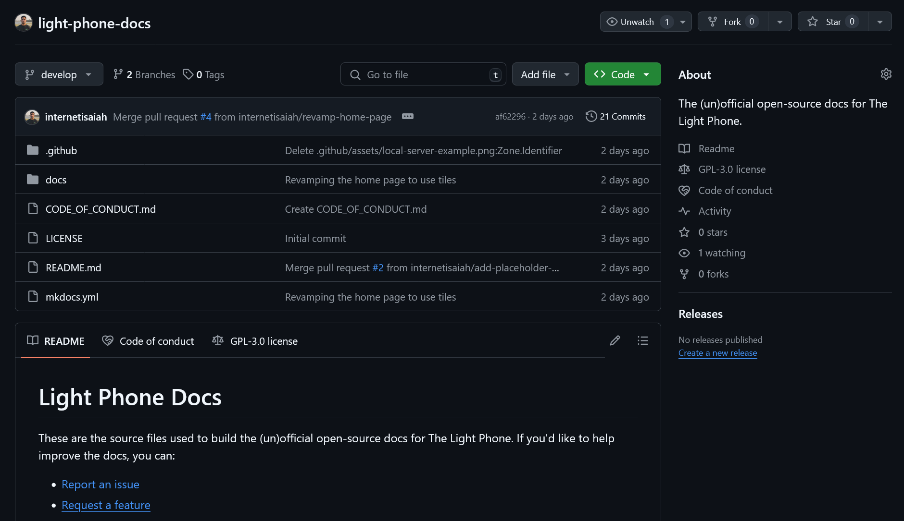
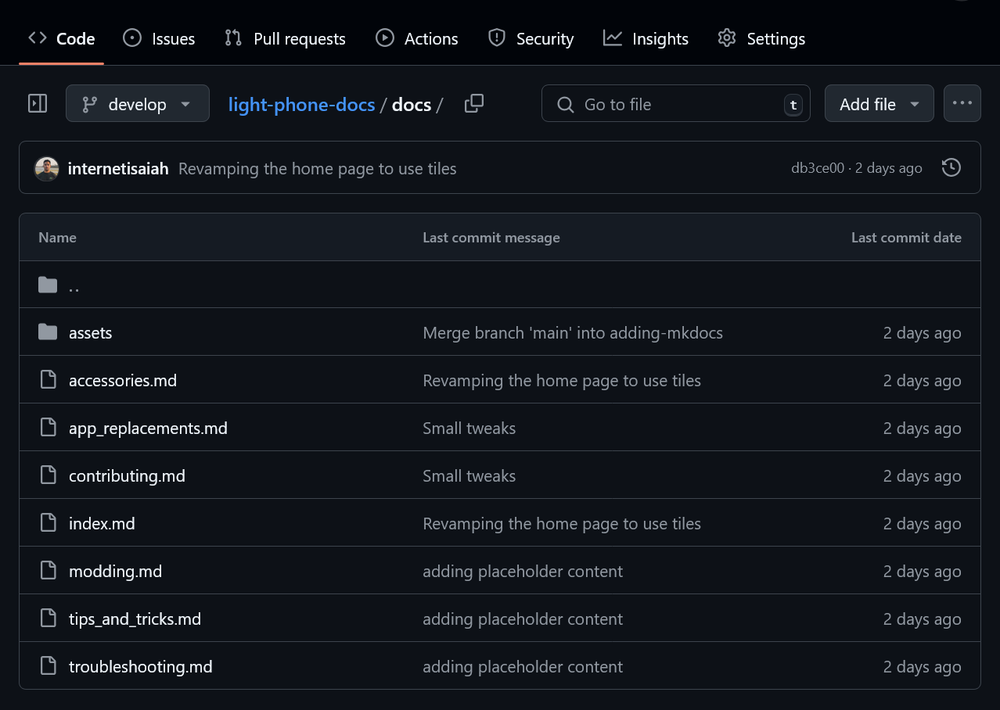
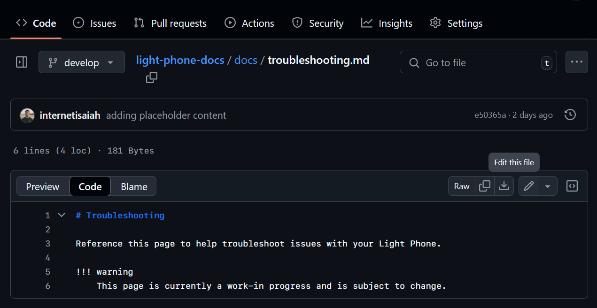
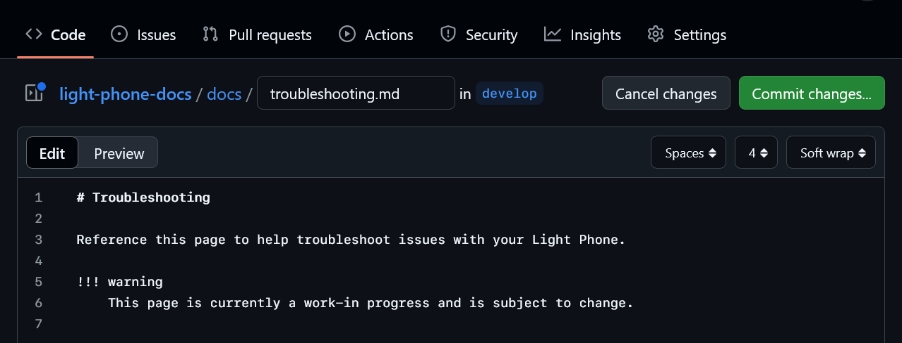
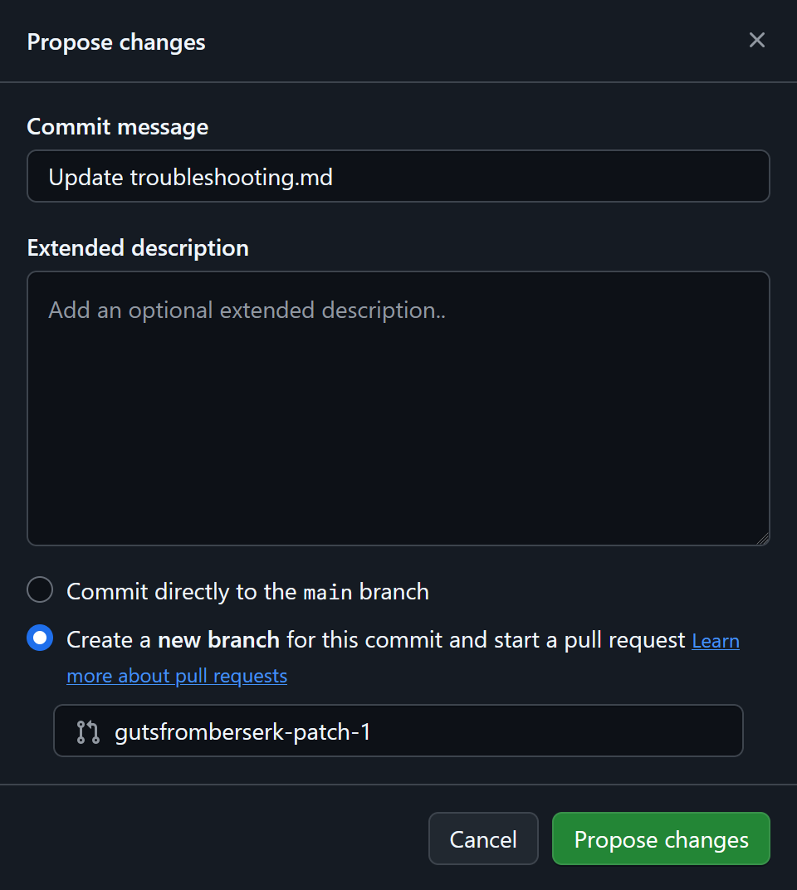
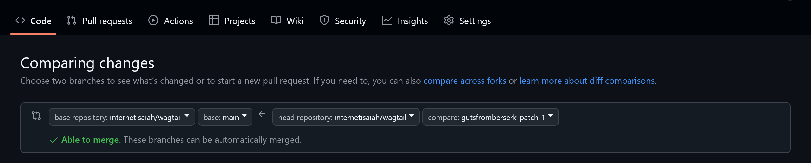
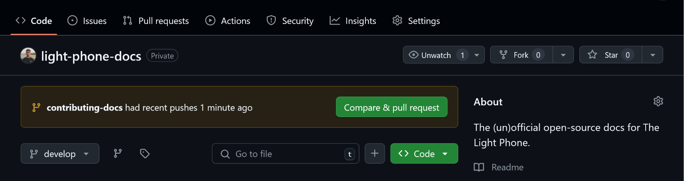
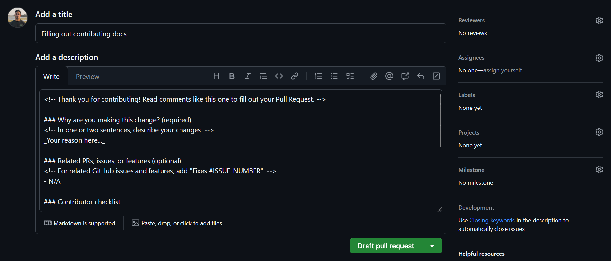
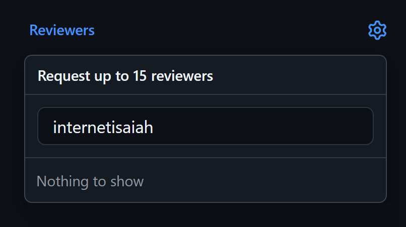

# Contributing to the docs

Thanks for helping improve our docs! We pledge to make participation in our community a harassment-free experience for everyone. For more information, see our [Code of Conduct](https://github.com/internetisaiah/light-phone-docs/blob/main/CODE_OF_CONDUCT.md).

!!! tip
    To learn more about the site's components and how to build the docs locally, see the repository's [README.md](https://github.com/internetisaiah/light-phone-docs/blob/develop/README.md).

## Making a contribution

### Prerequisites

Before you can contribute, you'll need a GitHub account. If you don't have one, [create one now](https://github.com/join).

### Step 1: Make a change

To make a change, you can use your web browser or the terminal. If you're new to Git or GitHub, we recommend using your browser.

=== "Using a web browser"

    #### Step 1.1: Find the page on GitHub

    In the [Light Phone Docs repository](https://github.com/internetisaiah/light-phone-docs), select `docs`.

    

    Each page's URL on Light Phone Docs reflects the repository's directory structure. Use your page's URL to find its corresponding Markdown file in the `docs` directory. For example, the Markdown file for `internetisaiah.github.io/light-phone-docs/troubleshooting` can be found in `docs` > `troubleshooting.md`.

    

    #### Step 1.2: Edit the file

    Select **Edit this file**, then make your changes using [Markdown formatting](https://www.markdownguide.org/basic-syntax/).

    

    !!! note
        If you're asked to fork the repository first, you can keep the default settings, then select **Create Fork**.

    When you're finished, select **Commit changes**.

    

    #### Step 1.3: Propose your changes

    In the next window, choose **Create a new branch for this commit and start a pull request**. If you choose the first option, your changes will not be sent to the correct location, so double-check that the correct option is selected before continuing.

    After confirming, select **Propose changes**.

    { width="70%" }

    In the next window, select **compare across forks**. From the base repository dropdown, choose **internetisaiah/light-phone-docs**, then select **Draft pull request**. You'll fill out the draft in the next step.

    

=== "Using the terminal"
    
    #### Step 1.1: Set up your local environment

    !!! note
        If you've already forked and cloned the repository, continue to the [next step](#get-the-latest-changes).
        
    Go to the [Light Phone Docs repository](https://github.com/internetisaiah/light-phone-docs) and select **Fork** > **Create Fork**.

    

    In your terminal, clone your forked repository.
    
    ```bash
    git clone ~/git@github.com:YOUR_GITHUB_USERNAME/light-phone-docs.git
    ```

    Replace `YOUR_GITHUB_USERNAME` with the name of your GitHub account. Your command should be similar to the following:

    ```bash
    git clone git@github.com:gutsfromberserk/light-phone-docs.git
    ```
    
    To ensure that your changes are pushed to the real repository instead of your fork, you'll need to set up a new remote in Git.

    ```bash
    cd ~/light-phone-docs
    git remote add target git@github.com:braze-inc/light-phone-docs.git
    ```

    To verify that your new remote was added successfully, you can list your remotes using the `remote` command's `-v` option.

    ```bash
    $ git remote -v
    origin  git@github.com:gutsfromberserk/light-phone-docs.git (fetch)
    origin  git@github.com:gutsfromberserk/light-phone-docs.git (push)
    target  git@github.com:internetisaiah/light-phone-docs.git (fetch)
    target  git@github.com:internetisaiah/light-phone-docs.git (push)
    ```

    #### Step 1.2: Get the latest changes

    In the repository, the `develop` branch reflects the most up-to-date version of Light Phone Docs. Check out the `develop` branch and pull the latest updates into your local environment.

    ```bash
    cd ~/light-phone-docs
    git checkout develop
    git pull
    ```

    #### Step 1.3: Create a new branch

    When making changes to the docs, you'll always create a new branch. Use `git branch` along with the `-b` flag to create a new branch.

    ```bash
    git checkout -b BRANCH_NAME
    ```

    Replace `BRANCH_NAME` with a short, non-space-separated description of your changes. Your command should be similar to the following:

    ```bash
    $ git checkout -b fixing-typo-in-troubleshooting
    Switched to a new branch 'fixing-typo-in-troubleshooting'
    ```

    #### Step 1.4: Edit the file

    In your text editor, open the document you want to change, then make your changes using [Markdown formatting](https://www.markdownguide.org/basic-syntax/).

    When you're finished, save your changes, then open your terminal and check your Git status. The output is similar to the following:

    ```bash
    $ git status
    On branch fixing-typo-in-troubleshooting
    Changes not staged for commit:
    (use "git add <file>..." to update what will be committed)
    (use "git restore <file>..." to discard changes in working directory)
            modified:   docs/_home/metadata.md

    no changes added to commit (use "git add" and/or "git commit -a")
    ```

    #### Step 1.5: Push your changes

    Use `git add` to tell Git which changes you want to stage for your commit. The following command shows two options:

    - **Left side of pipe:** Add all of your changed files using `--all`.
    - **Right side of pipe:** Add an individual file by replacing `PATH_TO_FILE` with the relative path to your changed file.

    ```bash
    git add {--all|PATH_TO_FILE}
    ```

    Use `git commit` with the `-m` flag to create your commit along with a short description (or message).

    ```bash
    git commit -m "COMMIT_MESSAGE"
    ```

    Replace `COMMIT_MESSAGE` with a short sentence describing your changes. Your command should be similar to the following:

    ```bash
    $ git commit -m "Fixing a typo in the troubleshooting doc"
    [fixing-typo-in-troubleshooting 8b05e34] Fixing a typo in the troubleshooting doc.
    1 file changed, 1 insertion(+), 1 deletion(-)
    ```

    Finally, push your changes to the Light Phone Docs.

    ```bash
    git push -u target BRANCH_NAME
    ```

    Replace `BRANCH_NAME` with the name of your branch. The output is similar to the following:

    ```bash
    $ git push -u target fixing-typo-in-troubleshooting
    Enumerating objects: 14, done.
    ...
    To github.com:internetisaiah/light-phone-docs.git
    * [new branch]      fixing-typo-in-troubleshooting -> fixing-typo-in-troubleshooting
    branch 'fixing-typo-in-troubleshooting' set up to track 'origin/fixing-typo-in-troubleshooting'.
    ```

    #### Step 1.6: Create your pull request

    Go back to the [repository homepage](https://github.com/internetisaiah/light-phone-docs) and select **Compare & pull request**. You'll fill out the draft in the next step.

    

### Step 2: Fill out your pull request

In the PR description, you'll see Markdown comments similar to the following:

```markdown
<!-- This is a Markdown comment. -->
```

These comments will guide you through your PR description. When you're finished, select the pull request dropdown, then select **Draft pull request**.



Finally, check **Allow edits and access to secrets from maintainers**. This will let us make style or formatting changes to your content during our review later.

### Step 3: Request a review

If you're ready for your work to be reviewed, select **Ready for review**.

{ width="75%" }

In the **Reviewers** field, type `internetisaiah`. Select the team name and press <kbd>Esc</kbd> or click out of the dropdown to confirm your selection.

{ width="60%" }

If we request additional changes after our review, you'll be notified per your [GitHub notification settings](https://docs.github.com/en/account-and-profile/managing-subscriptions-and-notifications-on-github/setting-up-notifications/configuring-notifications). Otherwise, we'll approve and merge your changes, so they go out with the next deployment.
